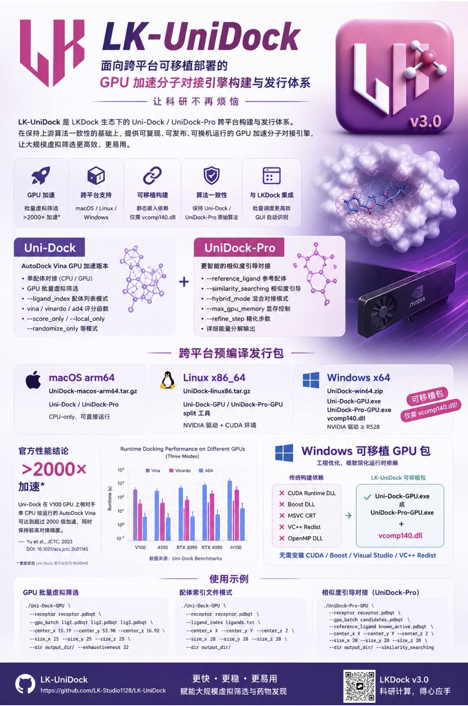

# LK-UniDock

> LK-UniDock is a collection of GPU-accelerated molecular docking engines maintained as part of [LKDock](https://github.com/). It provides pre-built portable binaries for all major platforms and patched source code for building from scratch, including **Windows GPU binaries** that the upstream projects do not officially distribute.

<p align="center">
  
</p>

---

## Table of Contents

- [Overview Poster](#overview-poster)
- [Engine Overview](#engine-overview)
- [Repository Structure](#repository-structure)
- [Pre-built Binaries](#pre-built-binaries)
- [Quick Start](#quick-start)
  - [Uni-Dock](#uni-dock-usage)
  - [UniDock-Pro](#unidock-pro-usage)
- [What We Changed vs Upstream](#what-we-changed-vs-upstream)
- [Building from Source](#building-from-source)
- [License](#license)

---

## Overview Poster

The overview poster summarizes LK-UniDock's cross-platform release packages, GPU acceleration features, Windows portable build strategy, and typical command-line usage.

> Third-party platform and hardware names/logos shown in the poster are used only for compatibility and descriptive purposes. LK-UniDock is not affiliated with or endorsed by Apple, Microsoft, NVIDIA, GitHub, or Linux trademark holders.

---

## Engine Overview

| Feature | Uni-Dock | UniDock-Pro |
|---|---|---|
| Version | v1.1.3 | v0.0.1 |
| Base | AutoDock-Vina (GPU fork) | Uni-Dock (extended fork) |
| macOS CPU global docking | ✅ Full support | ⚠️ Score/local only |
| Linux GPU virtual screening | ✅ | ✅ |
| Windows GPU virtual screening | ✅ (LK-UniDock build) | ✅ (LK-UniDock build) |
| Ligand format | PDBQT / SDF | PDBQT |
| Similarity-guided docking | ❌ | ✅ |
| Hybrid docking mode | ❌ | ✅ |
| Detailed energy decomposition | ❌ | ✅ |
| Upstream source | [dptech-corp/Uni-Dock](https://github.com/dptech-corp/Uni-Dock) | [NiBoyang/UniDock-Pro](https://github.com/NiBoyang/UniDock-Pro) |

---

## Repository Structure

```
LK-UniDock/
├── Uni-Dock-main/        # Patched Uni-Dock v1.1.3 source code
├── UniDock-Pro-main/     # Patched UniDock-Pro v0.0.1 source code
├── docs/assets/          # Project images and documentation assets
└── UniDock/              # Pre-built binaries (all platforms)
    ├── UniDock-macos-arm64/   # macOS Apple Silicon (CPU-only)
    ├── UniDock-linux86/       # Linux x86_64 (GPU)
    └── UniDock-win64/         # Windows x64 (GPU, portable)
```

---

## Pre-built Binaries

Download the latest release packages from the [**Releases**](../../releases) page.

| Platform | Archive | Contents | Requirements |
|---|---|---|---|
| macOS arm64 | `UniDock-macos-arm64.tar.gz` | `Uni-Dock`, `UniDock-Pro` | macOS 12+, no GPU needed |
| Linux x86_64 | `UniDock-linux86.tar.gz` | `Uni-Dock-GPU`, `UniDock-Pro-GPU`, `split` | NVIDIA driver ≥ R522 + CUDA |
| Windows x64 | `UniDock-win64.zip` | `Uni-Dock-GPU.exe`, `UniDock-Pro-GPU.exe`, `vcomp140.dll` | NVIDIA driver ≥ R528 |

### Windows GPU — What's Unique

The upstream projects **do not provide Windows GPU binaries**. LK-UniDock builds them with full static linking:

| Component | LK-UniDock build | Upstream GitHub release |
|---|---|---|
| **Windows GPU binary** | ✅ Provided | ❌ Not provided |
| **CUDA Runtime** | Statically embedded (no install needed) | Dynamic DLL required |
| **Boost** | Statically embedded (`-DFETCH_BOOST=ON`) | Dynamic conda DLL |
| **MSVC CRT** | Statically embedded (`-DBUILD_PORTABLE=ON`) | Requires VC++ Redist |
| **Runtime DLL dependencies** | **Only `vcomp140.dll`** (bundled) | 10+ DLLs (often missing) |
| **CUDA architectures** | sm_60 → sm_120 (GTX 10 → RTX 50) | Depends on CI environment |
| **Portability** | ✅ Copy exe + dll, runs anywhere | ❌ Often fails on new machines |

> **Minimum driver**: Windows GPU binaries require NVIDIA driver ≥ R528 (released late 2022). RTX 50 (Blackwell) additionally requires ≥ R570.

### Supported GPU Architectures (Windows/Linux GPU builds)

| Architecture | Representative GPUs | Supported |
|---|---|---|
| sm_60 / sm_61 | GTX 1060 / 1080 Ti | ✅ |
| sm_70 | Tesla V100 / Titan V | ✅ |
| sm_75 | RTX 20 series / T4 | ✅ |
| sm_80 / sm_86 | RTX 30 series / A100 | ✅ |
| sm_89 | RTX 40 series / L40 | ✅ |
| sm_90 | H100 | ✅ |
| sm_100 / sm_120 | **RTX 50 / Blackwell** | ✅ (CUDA 12.8 build) |

---

## Quick Start

### Uni-Dock Usage

**Single-ligand global docking (CPU — macOS / Linux / Windows)**
```bash
./Uni-Dock \
  --receptor receptor.pdbqt \
  --ligand ligand.pdbqt \
  --center_x 15.19 --center_y 53.90 --center_z 16.92 \
  --size_x 20 --size_y 20 --size_z 20 \
  --out output.pdbqt \
  --exhaustiveness 8 \
  --num_modes 9
```

**GPU batch virtual screening (Linux/Windows, NVIDIA GPU required)**
```bash
./Uni-Dock-GPU \
  --receptor receptor.pdbqt \
  --gpu_batch lig1.pdbqt lig2.pdbqt lig3.pdbqt \
  --center_x 15.19 --center_y 53.90 --center_z 16.92 \
  --size_x 25 --size_y 25 --size_z 25 \
  --dir output_dir/ \
  --exhaustiveness 32
```

**Large-scale screening with ligand index file**
```bash
# ligands.txt: one .pdbqt path per line (or space-separated)
./Uni-Dock-GPU \
  --receptor receptor.pdbqt \
  --ligand_index ligands.txt \
  --center_x X --center_y Y --center_z Z \
  --size_x 20 --size_y 20 --size_z 20 \
  --dir output_dir/
```

**Score only (evaluate existing pose)**
```bash
./Uni-Dock --receptor receptor.pdbqt --ligand ligand.pdbqt \
  --center_x X --center_y Y --center_z Z \
  --size_x 20 --size_y 20 --size_z 20 --score_only
```

**Key parameters**

| Parameter | Default | Description |
|---|---|---|
| `--exhaustiveness` | 8 | Search thoroughness (higher = more accurate, slower) |
| `--num_modes` | 9 | Max output conformations |
| `--energy_range` | 3.0 | Energy window (kcal/mol) |
| `--scoring` | vina | Scoring function: `vina`, `vinardo`, `ad4` |
| `--score_only` | — | Score current pose, no search |
| `--local_only` | — | Local optimization only |

---

### UniDock-Pro Usage

UniDock-Pro extends Uni-Dock with similarity-guided docking and hybrid modes. GPU is required for global docking; macOS supports score/local modes via CPU.

**Score only — CPU, macOS supported**
```bash
./UniDock-Pro \
  --receptor receptor.pdbqt \
  --ligand ligand.pdbqt \
  --center_x 15.19 --center_y 53.90 --center_z 16.92 \
  --size_x 20 --size_y 20 --size_z 20 \
  --score_only
# Output includes detailed energy decomposition:
# Score: -18.118 kcal/mol
# (1) Final Intermolecular Energy: -17.634 kcal/mol
# (2) Final Total Internal Energy: -0.485 kcal/mol
# (3) Torsional Free Energy:        5.121 kcal/mol
```

**GPU batch virtual screening**
```bash
./UniDock-Pro-GPU \
  --receptor receptor.pdbqt \
  --gpu_batch candidates.pdbqt \
  --center_x X --center_y Y --center_z Z \
  --size_x 20 --size_y 20 --size_z 20 \
  --dir output_dir/
```

**Similarity-guided docking (requires CUDA)**
```bash
./UniDock-Pro-GPU \
  --receptor receptor.pdbqt \
  --gpu_batch candidates.pdbqt \
  --reference_ligand known_active.pdbqt \
  --center_x X --center_y Y --center_z Z \
  --size_x 20 --size_y 20 --size_z 20 \
  --dir output_dir/ \
  --similarity_searching
```

**Hybrid mode (similarity + free docking)**
```bash
./UniDock-Pro-GPU \
  --receptor receptor.pdbqt \
  --gpu_batch candidates.pdbqt \
  --reference_ligand known_active.pdbqt \
  --center_x X --center_y Y --center_z Z \
  --size_x 20 --size_y 20 --size_z 20 \
  --dir output_dir/ \
  --hybrid_mode
```

**Additional UniDock-Pro parameters**

| Parameter | Description |
|---|---|
| `--reference_ligand <files>` | Reference ligand(s) for similarity-guided docking |
| `--similarity_searching` | Enable similarity search guidance |
| `--hybrid_mode` | Hybrid mode (similarity + free docking) |
| `--max_gpu_memory <MB>` | Limit GPU memory usage (default: all available) |
| `--refine_step <int>` | Refinement steps (default: 3) |

---

## What We Changed vs Upstream

The source code in `Uni-Dock-main/` and `UniDock-Pro-main/` is based on the upstream repositories with the following patches applied:

### 1. Boost Filesystem CUDA Guard — `src/lib/common.h`

**Problem**: When CUDA compilation units include `common.h`, the `boost/filesystem/path.hpp` header causes `__std_fs_copy_options`-related build errors under MSVC + CUDA 12.

**Fix**:
```cpp
// Before: direct include (fails in CUDA TUs under MSVC)
// After:
#ifndef __CUDACC__
#  include <boost/filesystem/path.hpp>
   using path = boost::filesystem::path;
#else
   typedef std::string path;  // std::string substitute for CUDA translation units
#endif
```

### 2. File I/O CUDA Guard — `src/lib/file.h`

Same pattern: `__CUDACC__` guard prevents CUDA TUs from pulling in Boost filesystem headers through `file.h`.

### 3. Cache Headers — `src/lib/cache.h` / `ad4cache.h`

Boost filesystem `#include` directives moved from headers to their corresponding `.cpp` files, preventing `monte_carlo.cu` from chain-importing Boost filesystem via headers.

### 4. CMakeLists.txt — Cross-platform Build System

Added to both `Uni-Dock-main/unidock/CMakeLists.txt` and `UniDock-Pro-main/CMakeLists.txt`:

| Addition | Purpose |
|---|---|
| `cmake_policy(SET CMP0167 NEW)` | Fix deprecated FindBoost warning (CMake ≥ 3.30) |
| `FORCE_CPU_ONLY` option | Build CPU-only version without CUDA |
| `BUILD_PORTABLE` option | Static linking of Boost, OpenMP, CUDA Runtime |
| `FETCH_BOOST` option | Auto-download Boost 1.84.0 if not found |
| macOS OpenMP detection | Find Homebrew `libomp`, static link if available |
| CUDA architecture auto-detection | Enable sm_100/sm_120 (Blackwell) when CUDA ≥ 12.8 |
| `/utf-8` MSVC flag | Suppress C4819 warnings for UTF-8 source files |
| `predict_peak_memory` `#ifdef ENABLE_CUDA` guard | Fix MSVC `/permissive-` template parse error in CPU builds |

### 5. Build Scripts (new files)

Platform-specific build scripts were added to both source folders:

| Script | Platform | Output |
|---|---|---|
| `build_mac.sh` | macOS (CPU-only) | `dist/Uni-Dock`, `dist/UniDock-Pro` |
| `build_linux.sh` | Linux (CPU + GPU) | `dist/Uni-Dock.bundle/`, `dist/Uni-Dock-GPU.bundle/` |
| `build_windows.bat` | Windows (CPU + GPU) | `dist\Uni-Dock.bundle\`, `dist\Uni-Dock-GPU.bundle\` |

### Summary: Upstream vs LK-UniDock

| Item | Upstream `dptech-corp/Uni-Dock` | LK-UniDock |
|---|---|---|
| Source version | v1.1.3 | v1.1.3 (same) |
| Windows GPU binary | ❌ Not provided | ✅ Provided |
| CUDA version | 11.8 (GitHub CI) | 12.8 (supports RTX 50/Blackwell) |
| CUDA Runtime | Dynamic (requires CUDA Toolkit) | Statically embedded |
| Boost | Dynamic (requires conda/vcpkg) | Statically embedded (`FETCH_BOOST=ON`) |
| MSVC CRT | Dynamic (requires VC++ Redist) | Statically embedded (`BUILD_PORTABLE=ON`) |
| Runtime DLL count (Windows) | 10+ | **1** (`vcomp140.dll`, bundled) |
| MSVC + CUDA build errors | Present | Fixed via `__CUDACC__` guards |

| Item | Upstream `NiBoyang/UniDock-Pro` | LK-UniDock |
|---|---|---|
| Source version | v0.0.1 | v0.0.1 (same) |
| Windows GPU binary | ❌ No release | ✅ Provided |
| LICENSE file | ❌ Missing | ✅ Apache 2.0 added |
| CI workflow | ❌ Missing | ✅ `.github/workflows/build.yml` added |
| Same MSVC/CUDA fixes | Applied | ✅ |

---

## Building from Source

### Prerequisites

| Tool | Min Version | Notes |
|---|---|---|
| CMake | 3.16+ | |
| C++ compiler | C++17 | GCC 7+ / Clang 5+ / MSVC 2019+ |
| Boost | 1.72+ | Or use `--fetch-boost` to auto-download |
| CUDA Toolkit | 11.8+ | GPU builds only |

### macOS (CPU-only — Apple Silicon does not support NVIDIA CUDA)

```bash
# Install dependencies
brew install cmake boost libomp

# Build Uni-Dock
cd Uni-Dock-main && bash build_mac.sh --clean

# Build UniDock-Pro
cd UniDock-Pro-main && bash build_mac.sh --clean
```

Output: `dist/Uni-Dock` and `dist/UniDock-Pro` (system-library-only, fully portable).

### Linux (CPU + GPU)

```bash
# Build both CPU and GPU variants
bash build_linux.sh

# CPU only
bash build_linux.sh --cpu-only

# GPU only (requires CUDA Toolkit >= 11.8)
bash build_linux.sh --gpu-only

# Auto-download Boost if not installed
bash build_linux.sh --fetch-boost
```

### Windows GPU Portable Build (recommended)

> Must run in **x64 Native Tools Command Prompt for VS 2022**.

Requires: Visual Studio 2022 + CUDA Toolkit 12.8 (supports GTX 10 → RTX 50 with one binary).

```bat
REM Set CUDA 12.8 environment
set CUDA_PATH=C:\Program Files\NVIDIA GPU Computing Toolkit\CUDA\v12.8
set CUDACXX=%CUDA_PATH%\bin\nvcc.exe
set PATH=%CUDA_PATH%\bin;%PATH%

REM Build Uni-Dock (portable — static Boost + CRT + CUDA Runtime)
cd Uni-Dock-main
cmake -S unidock -B build_portable ^
    -G "Visual Studio 17 2022" -A x64 ^
    -T cuda="%CUDA_PATH%" ^
    -DFETCH_BOOST=ON ^
    -DBUILD_PORTABLE=ON ^
    -DCMAKE_BUILD_TYPE=Release
cmake --build build_portable --config Release -j
```

Expected output:
```
[Uni-Dock] CUDA found: .../v12.8/bin/nvcc.exe. Building GPU-accelerated version.
[Uni-Dock] BUILD_PORTABLE=ON: using static CUDA runtime.
[Uni-Dock] CUDA >= 12.8 detected: enabling sm_100/sm_120 for Blackwell.
```

Result: `build_portable\Release\unidock.exe` — only requires `vcomp140.dll` at runtime.

See [`build_windows.bat`](./Uni-Dock-main/build_windows.bat) for the complete automated script.

### Common Build Errors

| Error | Cause | Fix |
|---|---|---|
| `[CPU-only build] GPU batch docking unavailable` | CUDA not detected | Use `-DCMAKE_CUDA_COMPILER=...` to specify nvcc explicitly |
| `boost/filesystem/path.hpp` compile error | CUDA TU importing Boost filesystem | Apply the `__CUDACC__` guard patches (already in this repo) |
| `boost_thread.lib (shared, Boost_USE_STATIC_LIBS=ON)` | conda Boost + `BUILD_PORTABLE=ON` conflict | Use `-DFETCH_BOOST=ON` to skip conda Boost |
| `nvcc fatal: Unsupported gpu architecture 'compute_60'` | CUDA 13+ (dropped Pascal/Volta) | Use CUDA 12.8 |
| CMake CUDA detection fails despite nvcc in PATH | `-T cuda="..."` path contains spaces | Use `-DCMAKE_CUDA_COMPILER=full\path\to\nvcc.exe` |

---

## License

Apache License 2.0.

- [`Uni-Dock-main/LICENSE`](./Uni-Dock-main/LICENSE)
- [`UniDock-Pro-main/LICENSE`](./UniDock-Pro-main/LICENSE)

Upstream projects:
- [dptech-corp/Uni-Dock](https://github.com/dptech-corp/Uni-Dock) — Apache 2.0
- [NiBoyang/UniDock-Pro](https://github.com/NiBoyang/UniDock-Pro) — Apache 2.0
- [ccsb-scripps/AutoDock-Vina](https://github.com/ccsb-scripps/AutoDock-Vina) — Apache 2.0 (original base)
